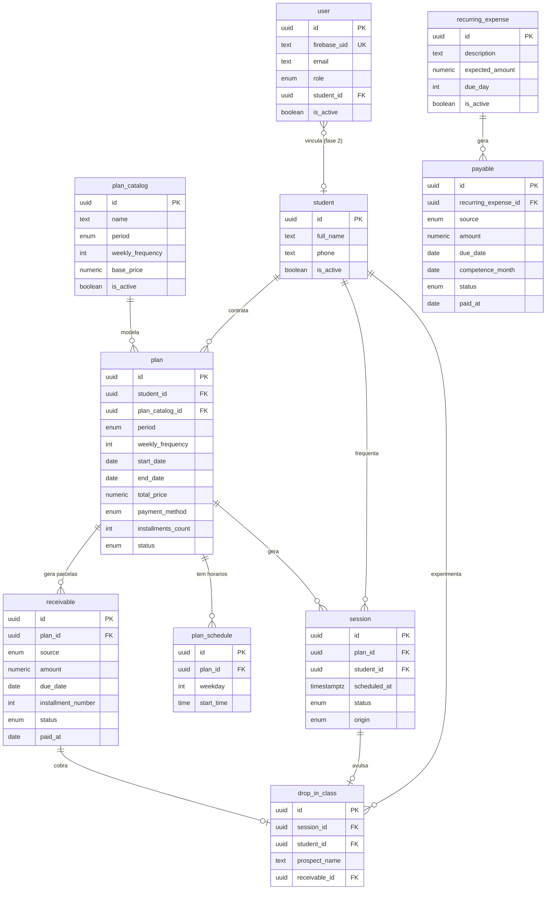

# Sistema de Gestão para Studio de Pilates
## Documento 02 — Modelo de Dados (v1)

> **Status:** rascunho para revisão
> **Base:** Documento 01 — Requisitos e Regras de Negócio (v1)
> **Banco:** PostgreSQL

---

## 1. Princípios de modelagem

1. **Catálogo vs. contratado.** Os tipos de plano que o studio oferece (catálogo, com preço de tabela) são separados do plano efetivamente contratado por um aluno (com datas e valores reais). O catálogo é apenas **base/sugestão**: o `total_price` do `plan` é um snapshot **livremente editável na criação** (campanhas, descontos), e não deriva nem se vincula ao preço do catálogo após a contratação.
2. **Regra-mãe → ocorrências materializadas.** Três geradores seguem o mesmo padrão: o plano gera *atendimentos* e *parcelas*; a despesa recorrente gera *lançamentos a pagar*. As ocorrências são linhas concretas e editáveis, independentes da regra após geradas.
3. **Passado imutável.** Atendimentos e lançamentos já gerados preservam seus dados mesmo que a regra de origem mude ou seja apagada. Por isso usamos `ON DELETE SET NULL` ou *snapshots* de campos onde faz sentido, nunca cascata destrutiva sobre o histórico.
4. **Identificadores.** Todas as tabelas usam `id uuid PRIMARY KEY DEFAULT gen_random_uuid()`. Datas de auditoria (`created_at`, `updated_at`) em todas as tabelas (omitidas na listagem para não poluir).
5. **Dinheiro.** Sempre `numeric(10,2)`. Nunca `float`.
6. **Enums.** Modelados como tipos `enum` do Postgres ou colunas `text` com `CHECK`. Aqui descrevo como enum lógico; a escolha física fica para a implementação.
7. **Soft delete.** Onde apagar destruiria histórico (aluno, plano), preferimos um campo de status/ativo a `DELETE` físico.

---

## 2. Visão geral das tabelas

| Tabela | Papel |
|---|---|
| `user` | Usuários do sistema (espelho do Firebase Auth) |
| `student` | Cadastro de alunos |
| `plan_catalog` | Catálogo de tipos de plano oferecidos |
| `plan` | Plano contratado por um aluno (ciclo) |
| `plan_schedule` | Horários fixos de um plano (dia da semana + hora) |
| `session` | Atendimento: aula concreta numa data, com presença |
| `drop_in_class` | Aula avulsa (fora de plano) |
| `receivable` | Lançamento a receber (parcela de plano, avulsa ou manual) |
| `payable` | Lançamento a pagar (despesa) |
| `recurring_expense` | Regra de despesa recorrente mensal |

---

## 3. Detalhamento das tabelas

### 3.0 `user` — Usuário do sistema

Espelho local do usuário autenticado no Firebase Auth. A identidade (login/senha) vive no Firebase; esta tabela guarda o vínculo com o domínio e o papel (autorização).

| Coluna | Tipo | Notas |
|---|---|---|
| `id` | uuid PK | |
| `firebase_uid` | text NOT NULL UNIQUE | UID do Firebase; chave de ligação com o token |
| `email` | text | copiado do token para exibição/contato |
| `role` | enum NOT NULL DEFAULT 'operator' | `operator` (v1); futuramente `teacher`, `student` |
| `student_id` | uuid FK → student | `ON DELETE SET NULL` — vínculo login↔aluno na fase 2; nulo para operador |
| `is_active` | boolean NOT NULL DEFAULT true | bloqueio de acesso sem apagar histórico |

**Regras:**
- **Provisionamento sob demanda (JIT):** o `AuthGuard` valida o token do Firebase (via Admin SDK); se não existir `user` com aquele `firebase_uid`, cria um na hora com `role='operator'` (v1). Não há cadastro manual de usuário.
- Na fase 2, contas de aluno terão `role='student'` e `student_id` preenchido; a criação JIT precisará distinguir o papel conforme a origem do cadastro (ponto a revisitar quando entrar o acesso de alunos).
- Método de login na v1: **e-mail/senha** (configurado no projeto Firebase).

---

### 3.1 `student` — Aluno

| Coluna | Tipo | Notas |
|---|---|---|
| `id` | uuid PK | |
| `full_name` | text NOT NULL | |
| `phone` | text | contato principal (WhatsApp) |
| `email` | text | opcional |
| `birth_date` | date | opcional |
| `notes` | text | observações livres (restrições físicas, etc.) |
| `is_active` | boolean NOT NULL DEFAULT true | soft delete / arquivamento |

Um aluno pode ter vários planos ao longo do tempo e mais de um plano ativo simultaneamente (conforme Doc 01).

---

### 3.2 `plan_catalog` — Catálogo de planos

Os "produtos" que o studio vende. Define período, frequência e preço de tabela.

| Coluna | Tipo | Notas |
|---|---|---|
| `id` | uuid PK | |
| `name` | text NOT NULL | ex.: "Trimestral 2x" |
| `period` | enum | `monthly` \| `quarterly` \| `semiannual` \| `annual` |
| `duration_months` | int NOT NULL | 1, 3, 6 ou 12 — derivado do período, persistido para clareza |
| `weekly_frequency` | int NOT NULL | nº de aulas por semana (= nº de horários fixos) |
| `base_price` | numeric(10,2) NOT NULL | preço de tabela |
| `is_active` | boolean NOT NULL DEFAULT true | se ainda é oferecido |

> O catálogo é uma conveniência. No `plan` o valor é copiado (snapshot), então alterar `base_price` aqui não muda contratos existentes.

---

### 3.3 `plan` — Plano contratado (ciclo)

Um ciclo de plano de um aluno. A renovação cria um **novo** registro de `plan`.

| Coluna | Tipo | Notas |
|---|---|---|
| `id` | uuid PK | |
| `student_id` | uuid FK → student NOT NULL | `ON DELETE RESTRICT` |
| `plan_catalog_id` | uuid FK → plan_catalog | `ON DELETE SET NULL` — snapshot abaixo preserva os dados |
| `period` | enum NOT NULL | snapshot do período contratado |
| `weekly_frequency` | int NOT NULL | snapshot |
| `start_date` | date NOT NULL | início do ciclo |
| `end_date` | date NOT NULL | término (start + duração) |
| `total_price` | numeric(10,2) NOT NULL | valor efetivamente contratado; **livremente definido na criação** (catálogo só sugere), permite descontos/campanhas |
| `payment_method` | enum | `cash` \| `pix` \| `card` \| `boleto` — **informativo** (meio predominante); o meio real fica em cada parcela. Pode ser nulo |
| `installments_count` | int NOT NULL DEFAULT 1 | nº de parcelas geradas (derivado da lista enviada; persistido para exibição) |
| `status` | enum NOT NULL | `active` \| `finished` \| `cancelled` |
| `notes` | text | |

**Regras:**
- `end_date` é calculado a partir de `start_date` + duração do período.
- "Vencendo / vencido" para os filtros de 7/30/60/90 dias usa `end_date`.
- Cancelar um plano não apaga atendimentos/parcelas passados; ver políticas de FK abaixo.

---

### 3.4 `plan_schedule` — Horários fixos do plano

Os dias/horas semanais do plano. Quantidade = `weekly_frequency`.

| Coluna | Tipo | Notas |
|---|---|---|
| `id` | uuid PK | |
| `plan_id` | uuid FK → plan NOT NULL | `ON DELETE CASCADE` (horários só fazem sentido com o plano) |
| `weekday` | int NOT NULL | 0–6 (domingo a sábado) ou `MO/TU/...`; padronizar na implementação |
| `start_time` | time NOT NULL | hora da aula, ex.: 17:00 |

**Regras:**
- A capacidade de turma (máx. 4) é validada por (weekday, start_time) ao criar/alterar — ver seção 4 (consultas).
- Na **alteração de horário** (Doc 01 §4.5): apagam-se as linhas antigas de `plan_schedule`, criam-se novas, e regeneram-se apenas os `session` futuros. Os `session` passados **não** referenciam `plan_schedule` de forma rígida (ver 3.5) justamente para sobreviverem a isso.

---

### 3.5 `session` — Atendimento (aula concreta)

Cada aula concreta de um aluno numa data. É o coração da agenda.

| Coluna | Tipo | Notas |
|---|---|---|
| `id` | uuid PK | |
| `plan_id` | uuid FK → plan | `ON DELETE SET NULL` — preserva histórico se o plano sumir |
| `student_id` | uuid FK → student NOT NULL | redundante com plan, mas garante histórico e simplifica consultas de agenda |
| `scheduled_at` | timestamptz NOT NULL | data + hora exata da aula (snapshot, não depende de plan_schedule) |
| `status` | enum NOT NULL | `scheduled` \| `present` \| `absence_notified` \| `absence_unnotified` \| `cancelled` |
| `origin` | enum NOT NULL DEFAULT 'plan' | `plan` \| `drop_in` — diferencia atendimento de plano e aula avulsa |
| `notes` | text | |

**Decisões-chave:**
- `scheduled_at` é um **snapshot** do dia/hora. O `session` **não** guarda FK para `plan_schedule`. Assim, quando os horários do plano mudam (e as linhas de `plan_schedule` são recriadas), os atendimentos passados continuam corretos e os futuros são regerados.
- `student_id` é desnormalizado de propósito: a agenda e o histórico do aluno consultam `session` diretamente, e o registro sobrevive mesmo se `plan_id` virar NULL.
- A capacidade de turma de 4 é verificada contando `session` com mesmo `scheduled_at` e status não-cancelado.
- Aulas avulsas também viram `session` com `origin = 'drop_in'` (ver 3.6 sobre o vínculo).

> **Índices sugeridos:** `(scheduled_at)` para a agenda; `(student_id, scheduled_at)` para histórico do aluno; `(plan_id)`.

---

### 3.6 `drop_in_class` — Aula avulsa

Aula pontual fora de plano (tipicamente experimental). Optei por uma tabela leve que complementa o `session`, em vez de espalhar campos opcionais por `session`.

| Coluna | Tipo | Notas |
|---|---|---|
| `id` | uuid PK | |
| `session_id` | uuid FK → session | `ON DELETE CASCADE` — a aula avulsa é representada por um session com origin='drop_in' |
| `student_id` | uuid FK → student | opcional: interessado pode não ser aluno cadastrado ainda |
| `prospect_name` | text | nome do interessado quando não há cadastro |
| `receivable_id` | uuid FK → receivable | `ON DELETE SET NULL` — se a avulsa for cobrada |

**Regras:**
- Toda aula avulsa cria um `session` (`origin='drop_in'`) para aparecer na agenda e ocupar vaga na turma, e uma linha `drop_in_class` com os dados extras.
- Pode ou não gerar `receivable` (Doc 01 §6.3).

> *Alternativa de modelagem considerada:* colocar `prospect_name` e flags diretamente em `session` e dispensar esta tabela. Mantive separada para não poluir `session` com campos quase sempre nulos. Decisão revisável na implementação.

---

### 3.7 `receivable` — Conta a receber

Lançamento a receber. Cobre parcelas de plano, aulas avulsas e lançamentos manuais.

| Coluna | Tipo | Notas |
|---|---|---|
| `id` | uuid PK | |
| `plan_id` | uuid FK → plan | `ON DELETE SET NULL` — parcela sobrevive; nulo se manual/avulsa |
| `source` | enum NOT NULL | `plan` \| `drop_in` \| `manual` |
| `description` | text NOT NULL | ex.: "Parcela 2/6 — Plano Trimestral" |
| `amount` | numeric(10,2) NOT NULL | |
| `due_date` | date NOT NULL | vencimento |
| `installment_number` | int | nº da parcela (1..N), nulo se não-parcelado |
| `installment_total` | int | total de parcelas, nulo se não-parcelado |
| `payment_method` | enum | meio previsto/usado; padrão herdado do plano, editável |
| `status` | enum NOT NULL DEFAULT 'pending' | `pending` \| `paid` (\| atrasado é derivado, ver abaixo) |
| `paid_at` | date | data da baixa, preenchida ao marcar pago |

**Regras:**
- **Geração por plano:** ao criar um `plan`, o front envia as parcelas já montadas (valor, vencimento, meio de pagamento e, opcionalmente, status pago). O backend **persiste como recebido**, apenas validando que a soma das parcelas = `total_price` (tolerância de centavos; resíduo na última). À vista → 1 parcela (Doc 01 §6.2).
- Uma parcela pode já nascer com `status='paid'` (1ª parcela quitada no ato), com `paid_at` preenchido.
- **Atrasado é derivado:** não é um valor de `status`. Calcula-se: `status = 'pending' AND due_date < hoje`. Evita job para "envelhecer" lançamentos. Os filtros e relatórios aplicam essa regra na consulta.
- Lançamentos manuais: `source='manual'`, `plan_id` nulo.

> **Índices sugeridos:** `(due_date, status)` para o painel financeiro; `(plan_id)`.

---

### 3.8 `payable` — Conta a pagar

Lançamento a pagar (despesa). Pode ser avulso/manual ou gerado por uma despesa recorrente.

| Coluna | Tipo | Notas |
|---|---|---|
| `id` | uuid PK | |
| `recurring_expense_id` | uuid FK → recurring_expense | `ON DELETE SET NULL` — lançamento sobrevive se a regra sumir; nulo se manual |
| `source` | enum NOT NULL | `recurring` \| `manual` |
| `description` | text NOT NULL | |
| `category` | text | ex.: "Aluguel", "Energia" (herdada da regra ou livre) |
| `amount` | numeric(10,2) NOT NULL | editável mesmo quando veio de recorrente |
| `due_date` | date NOT NULL | |
| `competence_month` | date | mês de competência (1º dia do mês), p/ recorrentes |
| `status` | enum NOT NULL DEFAULT 'pending' | `pending` \| `paid` (atrasado derivado) |
| `paid_at` | date | |
| `payment_method` | enum | opcional |

**Regras:**
- Mesma regra de "atrasado derivado" do `receivable`.
- Lançamentos vindos de despesa recorrente: `source='recurring'`, `recurring_expense_id` preenchido, `competence_month` indica a que mês se refere.
- O valor é editável após a geração sem afetar a regra (Doc 01 §6.7).

> **Índices sugeridos:** `(due_date, status)`; `(recurring_expense_id, competence_month)` — este último também serve à idempotência (ver abaixo).

---

### 3.9 `recurring_expense` — Despesa recorrente

Regra que gera lançamentos a pagar mensais.

| Coluna | Tipo | Notas |
|---|---|---|
| `id` | uuid PK | |
| `description` | text NOT NULL | ex.: "Aluguel" |
| `category` | text | |
| `expected_amount` | numeric(10,2) NOT NULL | valor previsto (fixo); copiado para o lançamento |
| `due_day` | int NOT NULL | dia do mês do vencimento (1–28 recomendado p/ evitar meses curtos) |
| `is_active` | boolean NOT NULL DEFAULT true | desativar interrompe gerações futuras |

**Regras de geração (Doc 01 §6.7 + §7.1):**
- Job roda dia 25, mês `M`. Para cada `recurring_expense` ativa, cria um `payable` com `competence_month` = 1º dia de `M+1`, `due_date` = `due_day` de `M+1`, `amount` = `expected_amount`.
- **Idempotência:** antes de inserir, verifica se já existe `payable` com mesmo `(recurring_expense_id, competence_month)`. Reforçar com **índice único** parcial em `payable (recurring_expense_id, competence_month) WHERE source='recurring'`.
- Desativar não toca lançamentos já gerados.

---

## 4. Consultas/validações críticas (regras que viram código)

1. **Capacidade da turma (máx. 4):** ao alocar um aluno em (weekday, start_time) ou ao gerar/regenerar sessions, contar sessions existentes no mesmo `scheduled_at` com `status <> 'cancelled'`. Bloquear se já houver 4. *Recomenda-se também uma trava no banco* (ver seção 5).
2. **Filtro de vencimento de planos (7/30/60/90 + vencidos):** `plan.end_date <= hoje + intervalo`, incluindo `end_date < hoje`.
3. **Atrasados (financeiro):** `status='pending' AND due_date < hoje`, aplicado a `receivable` e `payable`.
4. **Geração de sessions na criação do plano:** para cada `plan_schedule`, iterar de `start_date` a `end_date`, criando um `session` em cada data correspondente ao `weekday`/`start_time`. Inclui feriados (Doc 01 §4.4).
5. **Alteração de horário:** apagar `session` futuros (`scheduled_at >= agora`) do plano + recriar `plan_schedule` + regerar sessions futuros.

---

## 5. Integridade no banco (travas recomendadas)

- **Índice único parcial** em `payable (recurring_expense_id, competence_month) WHERE source='recurring'` — garante idempotência da geração recorrente.
- **Capacidade da turma:** difícil de garantir 100% por constraint pura (é um COUNT por chave composta). Estratégias: (a) validar na camada de aplicação dentro de transação com `SERIALIZABLE` ou lock; (b) tabela auxiliar de "slot" com contador; (c) trigger. Para a v1 com um único operador e baixa concorrência, validação em aplicação dentro de transação é suficiente — documentar como ponto de atenção se entrar autoagendamento (concorrência real).
- **FKs de histórico:** `session.plan_id`, `receivable.plan_id`, `payable.recurring_expense_id`, `drop_in_class.receivable_id` usam `ON DELETE SET NULL`. `plan_schedule.plan_id` usa `CASCADE`. `plan.student_id` usa `RESTRICT` (não deixa apagar aluno com plano; usa-se `is_active=false`).

---

## 6. Diagrama de relacionamentos (ER)

---

## 7. Pontos em aberto para a próxima etapa

1. ~~Confirmar se `drop_in_class` separada vale a pena~~ — **Resolvido:** tabela separada.
2. Definir representação física dos enums (tipo `enum` nativo vs. `text` + `CHECK`) — afeta migrações futuras. Será decidido no Documento 03.
3. Definir estratégia de migrations (TypeORM, Prisma, ou SQL puro) — será decidida no Documento 03 (Arquitetura).
4. ~~Confirmar `due_day` limitado a 1–28~~ — **Resolvido:** `due_day` restrito a 1–28.

---

## 8. Próximo documento

- **03 — Arquitetura Técnica:** estrutura React + Vite no front; NestJS modular no back (módulos espelhando estes agregados); escolha de ORM/migrations; organização de pastas; o agendador (`@nestjs/schedule`); e como as regras desta modelagem viram serviços.
